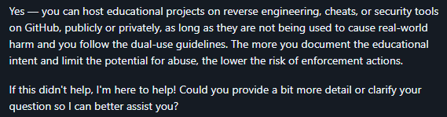
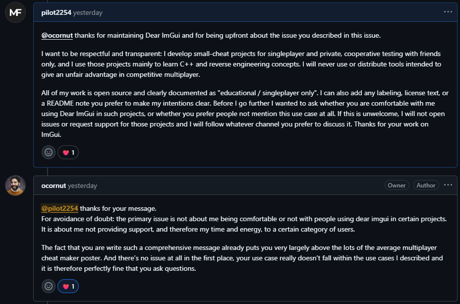

# Hi there 👋
You might be wondering why I separated some of my projects from my [main GitHub profile](https://github.com/pilot2254). It's because I didn't want to create a mess there with repositories like: forks, personal projects, public projects, learning materials, etc. So I created this organization for the sole purpose of learning something new. However, keep in mind that although this organization contains game cheats, it is not only for them.

## Notice
> [!IMPORTANT]
> It includes a range of repositories, from beginner-level code to game cheat prototypes. Please note that:
>
> All game cheat repositories are strictly for educational use. While some target multiplayer games (e.g., CS2, Lethal Company, AssaultCube, No Man's Sky, and more), they were tested only in controlled environments (custom lobbies, singleplayer mode, bots, and consenting peers with anti-cheat disabled).
>
> Every such repository contains a clear disclaimer: FOR EDUCATIONAL PURPOSES ONLY. 
> These projects were created solely for learning. Do not report me or this github organization or its repositories, I do not support, promote cheating or abuse in multiplayer environments.
>
> I do not condone misuse. I accept no responsibility for bans, kicks, or consequences arising from unauthorized use.

## My personal quote
> A game cheater mindlessly consumes pre-made cheats to gain advantage. A game hacker builds cheats, dissecting systems and exploiting weaknesses. Cheaters learn nothing. Cheat devs learn everything.

<!-- ========================================================================================================================================================================================================== -->
<!-- ================================================================================================ FAQ SECTION ============================================================================================= -->
<!-- ========================================================================================================================================================================================================== -->
   

## FAQ

<!-- ================================================================================================ FAQ ITEM ================================================================================================ -->

  
  
Are these cheats intended for real online play?

   
  No. Every single repository here is for educational use only. 
  I do not support, condone, or promote cheating in multiplayer environments. 
  All testing is done in controlled setups - private lobbies, bots, or with consenting peers. 
  If you misuse the code, that’s entirely on you.
  
---

<!-- ================================================================================================ FAQ ITEM ================================================================================================ -->

  
  
Does GitHub allow users to store cheats and malware in their repositories?

   
  This is how copilot replied to my GitHub support ticket:
    
  
  
---

<!-- ================================================================================================ FAQ ITEM ================================================================================================ -->

  
Why do you use ImGui for cheat-related projects if the creator discouraged it?

   
  This is a common concern, and it was also described directly in the <a href="https://github.com/ocornut/imgui/issues/1586">ImGui issue #1586</a>. 
  Here is ocornut's response to my question for context:
    
  
    
  TL;DR, the maintainer clarified that the main issue is not about banning certain use cases, but about not providing support for cheat-related projects. Since my projects are strictly singleplayer, educational, and open-source, they don't fall under the problematic category.  
  But to respect creator's position, I do not request support for these projects often.

  ---

<!-- ================================================================================================ FAQ ITEM ================================================================================================ -->

  
Why did you separate learning materials from your main profile?

   
  Like I said before, It's because I didn't want to create a mess there with repositories like: forks, personal projects, public projects, learning materials, etc.
  
---

<!-- ================================================================================================ FAQ ITEM ================================================================================================ -->

  
How did you get started making game cheats?

   
  Since I was studying app development at home and game development at school, I wondered how I could combine these two subjects to learn something new. I searched for tutorials online and started learning Cheat Engine. After I learned the basics, I started combining it with dnSpy, and I'm currently on my way to combining it with C++.

---

<!-- ================================================================================================ FAQ ITEM ================================================================================================ -->

  
What was the first game for which you made a cheat?

   
  Obviously, it was the Cheat Engine tutorial 😅. 
  But, to be honest, I don't really remember what the first game I made cheats for was. I think it was GTFO

---
  

<!-- ================================================================================================ FAQ ITEM ================================================================================================ -->

  
I want to start reverse engineering and/or game hacking. Where should I start?

   
  
  Start by reading these 3 blogs, they include almost all info and tutorial links you will need:
  - How to start reverse engineering: https://pilot2254.github.io/blog/how-to-start-reverse-engineering/
  - What tools do I use for reverse engineering: https://pilot2254.github.io/blog/reverse-engineering-tools-i-use/
  - How to start game hacking: https://pilot2254.github.io/blog/how-to-start-game-hacking/

---

<!-- ================================================================================================ FAQ ITEM ================================================================================================ -->

  
  
Why focus on cheats if you don’t support cheating?

   
  
  For me, it’s fun. While learning how to make cheats, I picked up a massive amount of knowledge in programming, reverse engineering, and general computer science. It’s not about gaining unfair advantage, it’s about learning how systems really work. I dont cheat in competitive games.
  
---

<!-- ================================================================================================ FAQ ITEM ================================================================================================ -->

  
  
Why do you include multiplayer games if you don’t condone online cheating?

   
  
  Because different games pose different challenges. Multiplayer titles often have protections and systems worth studying. Every multiplayer cheat I’ve built was tested only in controlled environments—bots, private lobbies, or with consenting friends. Never in live matchmaking.
  
---

<!-- ================================================================================================ FAQ ITEM ================================================================================================ -->

  
  
Can others contribute to these repositories?

   
  
  Yes. Even though this organization is primarily for my own learning, you’re welcome to open pull requests. If your contribution makes sense, I’ll be happy to merge it.
  
---
  

<!-- ================================================================================================ FAQ ITEM ================================================================================================ -->

  
  
Do you plan to transition this knowledge into anti-cheat development?

   
  
  I’ve thought about it. Right now, I don’t have the skills or resources to make a serious anti-cheat project. Maybe later. It’s a goal for the future.
  
---

<!-- ================================================================================================ FAQ ITEM ================================================================================================ -->

  
  
What’s the hardest challenge you faced while making cheats?

   
  
  Anticheat systems. Even the basic ones can wreck a beginner. I’m still at the beginner/intermediate stage myself, and anticheat has always been the biggest wall.
  
---
  

<!-- ================================================================================================ FAQ ITEM ================================================================================================ -->

  
  
What’s the educational value in building cheats?

   
  
  Immense. That's why am I doing this stuff. 
  If done properly, game hacking teaches memory management, assembly, reverse engineering, system internals, and practical problem-solving. It’s one of the most hands-on ways to dig into computer science.
  
---
  

<!-- ================================================================================================ FAQ ITEM ================================================================================================ -->

  
  
Are you a lazy person?

   
  
  Absolutely. I’m a certified procrastinator. Probably the laziest person alive. Somehow still managing to build this stuff anyway. 
  Now seriously, i'm suffering from executive dysfunction... And i hate that about myself
  
---
  

<!-- ================================================================================================ FAQ ITEM ================================================================================================ -->

  
Why do you prefer saying "Cheat Dev" instead of "Hacker"?

   

  The word "hacker" gets thrown around way too much. 
  A lot of people (mostly kids) use it for anything even slightly techy, whether it's coding, making cheats, or actual hacking. Some even call cheaters "hackers" just because they brainlessly downloaded something off the internet. 
  Over time it started to sound kinda cringe to me, so I just stick with "Cheat Dev." Feels more accurate and way less annoying in my opinion.

---

<!--

  
text text text

   
  text text text

---
  

-->
